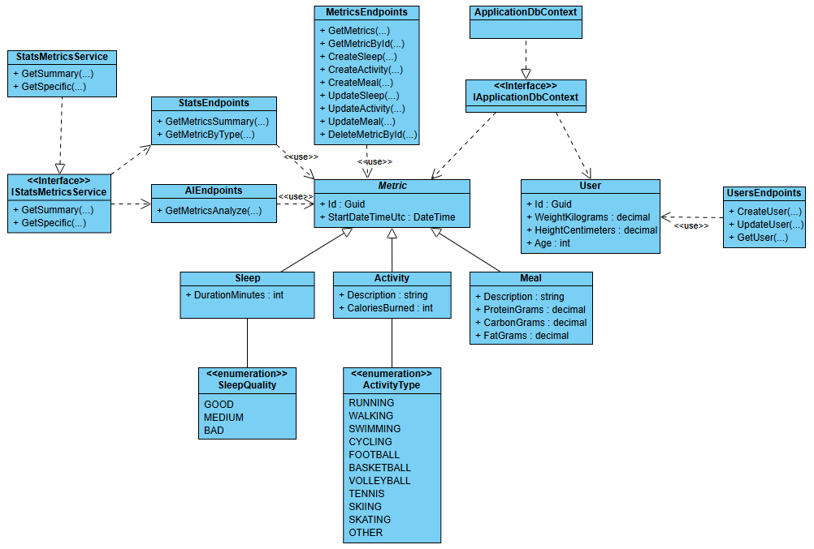

# AI Personal Health and Habit Coach

API do zarządzania metrykami zdrowotnymi użytkownika (sen, aktywność, posiłki) z możliwością generowania inteligentnych rekomendacji AI.  

## Endpoints

### 1. Metrics

| Metoda | Endpoint | Parametry | Opis |
|--------|---------|-----------------|------|
| GET    | /metrics | Query: `page` (optional), `pageSize` (optional), `type` (optional: sleep, activity, meal) | Pobiera wszystkie metryki z paginacją i możliwością filtrowania po typie |
| GET    | /metrics/{id} | Path: `id` | Pobiera konkretną metrykę |
| POST   | /metrics/sleep | Body: `DurationMinutes`, `SleepQuality`, `StartDate` | Dodaje nowe dane dotyczące snu |
| POST   | /metrics/activity | Body: `Description`, `CaloriesBurned`, `ActivityType`, `StartDate` | Dodaje nowe dane dotyczące aktywności |
| POST   | /metrics/meal | Body: `Description`, `ProteinGrams`, `CarbonGrams`, `FatGrams`, `StartDate` | Dodaje nowe dane dotyczące posiłku |
| PUT    | /metrics/sleep/{id} | Path: `id`, Body: `DurationMinutes`, `SleepQuality`, `StartDate` | Aktualizuje dane dotyczące snu |
| PUT    | /metrics/activity/{id} | Path: `id`, Body: `Description`, `CaloriesBurned`, `ActivityType`, `StartDate` | Aktualizuje dane dotyczące aktywności |
| PUT    | /metrics/meal/{id} | Path: `id`, Body: `Description`, `ProteinGrams`, `CarbonGrams`, `FatGrams`, `StartDate` | Aktualizuje dane dotyczące posiłku |
| DELETE | /metrics/{id} | Path: `id` | Usuwa konkretną metrykę |

---

### 2. Stats

| Metoda | Endpoint | Parametry | Opis |
|--------|---------|-------|------|
| GET    | /stats/metrics/summary | Query: `startDate`, `endDate` | Raport ogólny metryk w zadanym okresie |
| GET    | /stats/metrics/{type} | Path: `type` (sleep, activity, meal), Query: `startDate`, `endDate` | Statystyki dotyczące danej metryki w zadanym okresie |

---

### 3. AI

| Metoda | Endpoint | Parametry | Opis |
|--------|---------|-------|------|
| GET    | /ai/metrics/analyze | Query: `startDate`, `endDate`, `question` | Dostarcza podsumowanie i rekomendacje oparte na metrykach z wybranego okresu oraz informacjach o użytkowniku. Umożliwia również zadanie pytania, na które odpowiedź zostanie wygenerowana w kontekście tych danych. |

---

### 4. User

| Metoda | Endpoint | Parametry | Opis |
|--------|---------|-------|------|
| GET    | /users | - | Pobiera dane o użytkowniku |
| POST   | /users | Body: `WeightKilograms`, `HeightCentimeters`, `Age` | Dodaje dane o użytkowniku |
| PUT    | /users | Body: `WeightKilograms`, `HeightCentimeters`, `Age` | Aktualizuje dane o użytkowniku |

## Diagram UML

